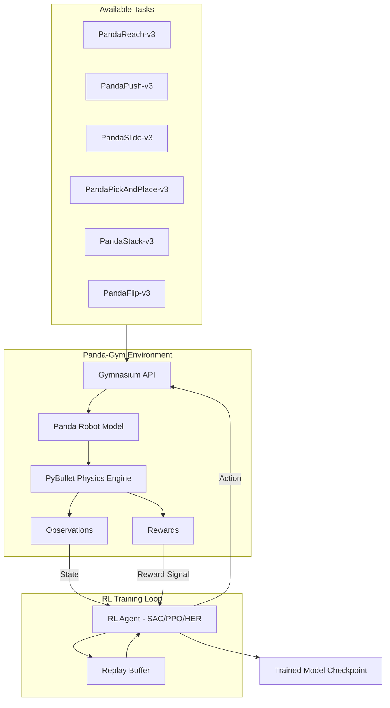

# Robotic_reinforce 🤖🦾

[](https://github.com/krishnakumarbhat/Robotic_reinforce/actions/workflows/ci.yml)

Reinforcement learning for robotic manipulation tasks using **panda-gym** environments built on PyBullet physics engine and Gymnasium. Train RL agents to perform goal-conditioned tasks like reaching, pushing, sliding, and pick-and-place with a simulated Franka Emika Panda robot arm.

## 🏗️ Architecture



## 🚀 Features

- **6 Goal-Conditioned Tasks**: Reach, Push, Slide, Pick-and-Place, Stack, Flip
- **PyBullet Physics**: Realistic rigid-body simulation
- **Gymnasium Compatible**: Standard RL API (`reset`, `step`, `render`)
- **Pre-trained Baselines**: SAC models available via Hugging Face Hub
- **Modular Design**: Easy to add custom tasks and reward functions

## 🛠️ Tech Stack

| Component           | Technology                   |
| ------------------- | ---------------------------- |
| RL Framework        | Gymnasium, Stable-Baselines3 |
| Physics Engine      | PyBullet                     |
| Robot Model         | Franka Emika Panda (7-DOF)   |
| Training Algorithms | SAC, PPO, HER                |
| Language            | Python 3.10+                 |

## 📦 Installation

```bash
# Clone the repository
git clone https://github.com/krishnakumarbhat/Robotic_reinforce.git
cd Robotic_reinforce

# Install panda-gym
pip install -e panda-gym/
```

## ▶️ Quick Start

```python
import gymnasium as gym
import panda_gym

env = gym.make('PandaReach-v3', render_mode="human")
observation, info = env.reset()

for _ in range(1000):
    action = env.action_space.sample()
    observation, reward, terminated, truncated, info = env.step(action)
    if terminated or truncated:
        observation, info = env.reset()

env.close()
```

## 📁 Project Structure

```
Robotic_reinforce/
├── panda-gym/
│   ├── panda_gym/           # Environment source code
│   │   ├── envs/            # Gymnasium environments
│   │   ├── assets/          # Robot URDF models
│   │   └── utils/           # Helper utilities
│   ├── test/                # Unit tests
│   ├── examples/            # Example scripts
│   ├── docs/                # Documentation
│   └── setup.py             # Package configuration
├── .github/workflows/       # CI/CD pipeline
├── .gitignore
└── README.md
```

## 🧪 Running Tests

```bash
cd panda-gym
pip install pytest
pytest test/ -v
```

## 📖 References

- [panda-gym paper (NeurIPS 2021 Workshop)](https://arxiv.org/abs/2106.13687)
- [Stable-Baselines3 Zoo](https://github.com/DLR-RM/rl-baselines3-zoo)
- [OpenAI Fetch Environments](https://openai.com/blog/ingredients-for-robotics-research/)

## 📝 License

MIT License

## 🤝 Contributing

1. Fork the repository
2. Create a feature branch: `git checkout -b feature-name`
3. Commit your changes: `git commit -m 'Add feature'`
4. Push to the branch: `git push origin feature-name`
5. Open a pull request
